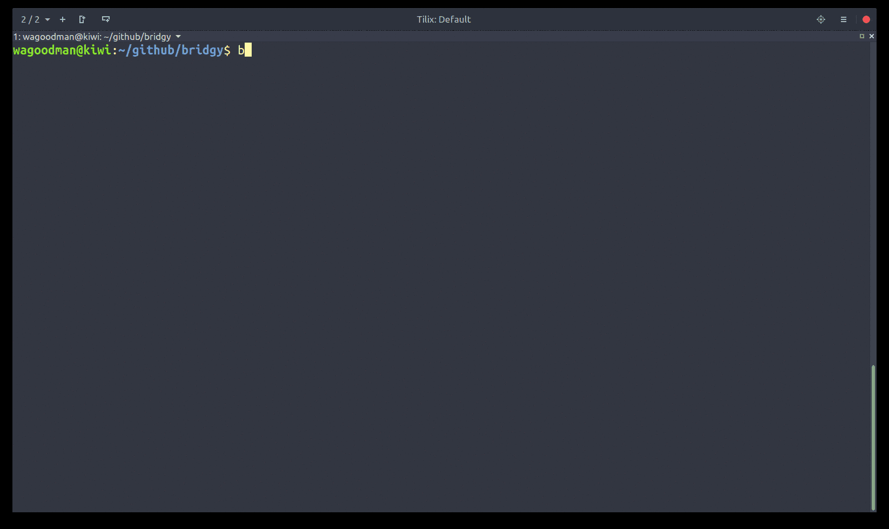

# bridgy


*TL;DR: this tool =  ssh + tmux + sshfs + cloud inventory search*

**Note: this is a work in progress (alpha-ish)**

Just get me to my ec2 box with a simple search. Multiple matches? Just
ssh into all matching instances via tmux.



Have a special multi-pane layout for every system you login to? Drop it in
the config (~/.bridgy/config.yml), reference it by name:
```
tmux:
  layouts:
    logger:
      - cmd: split-window -h
      - cmd: split-window -h
      - cmd: split-window -v
        run: tail -f /var/log/messages
```
then...
```
$ python bridgy ssh -l logger awesomebox
```

Want to mount a dir from your ec2 instance locally?

```
$ python bridgy sshfs awesomebox:/appdir/
[?] What instances would you like to have mounted? (enter to select):
 > o dev-myawesomeboxname
   o qa-myawesomeboxname

Mounted dev-myawesomeboxname:/tmp at ~/.bridgy/mounts/dev-myawesomeboxname
```

## Features

- [x] fuzzy search ec2 instances to IP
- [x] prompt for selecting target (matched) hosts
- [x] multi-select from matche host options
- [x] open multiple ec2 ssh connections via tmux (splits or tabs)
- [x] configure tmux layouts for one or more ec2 connections
- [ ] open ssh tunnel for remote debuggers
- [x] seamless bastion hopping (via configuration)
- [ ] push / pull files to and from instances (ansible? scp?)
- [x] setup sshfs mount to a remote dir
- [x] templating configurations for logging into systems and running commands
- [x] supported inventory backends
  - [x] aws
  - [ ] google cloud
  - [ ] ansible inventory
  - [x] new relic
  - [x] csv

## Installing

```
sudo apt install -y sshfs tmux
pip install bridgy
```

## Usage
```
  bridgy ssh [-auwvd] [-l LAYOUT] <host>...
  bridgy ssh [-uvd] --no-tmux <host>
  bridgy list-inventory
  bridgy list-mounts
  bridgy mount [-vd] <host>:<remotedir>
  bridgy unmount [-vd] (-a | <host>...)
  bridgy update [-v]
  bridgy (-h | --help)
  bridgy --version

Sub-commands:
  ssh           ssh into the selected host(s)
  mount         use sshfs to mount a remote directory to an empty local directory (linux only)
  unmount       unmount one or more host sshfs mounts (linux only)
  list-mounts   show all sshfs mounts (linux only)
  update        pull the latest inventory from your cloud provider

Options:
  -a        --all            Automatically use all matched hosts.
  -d        --dry-run        Show all commands that you would have run, but don't run them (implies --verbose)
  -l LAYOUT --layout LAYOUT  Use a configured lmux layout for each host.
  -n        --no-tmux        Ssh into a single server without tmux
  -u        --update         pull the latest instance inventory from aws then run the specified command
  -w        --windows        Use tmux windows instead of panes for each matched host.
  -h        --help           Show this screen.
  -v        --verbose        Show debug information.
  --version                  Show version.

Configuration Options are in ~/.bridgy/config.yml
```
